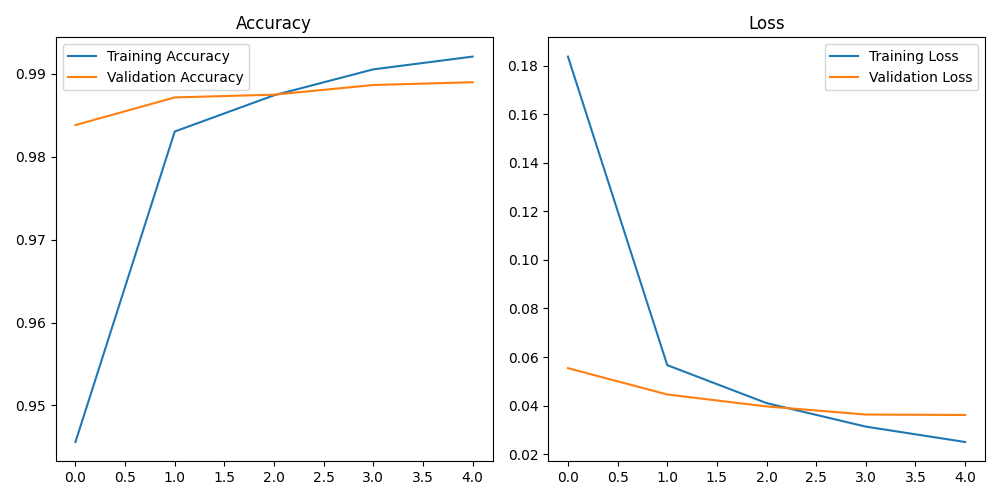

# MNIST Digit Classification with CNN

A convolutional neural network (CNN) implementation using TensorFlow/Keras to classify handwritten digits from the MNIST dataset.



## Features
- 95%+ accuracy on MNIST test set
- Clean, modular Python implementation
- Training visualization
- Saved model for easy reuse

## Requirements
- Python 3.9-3.11
- TensorFlow 2.x
- Matplotlib
- NumPy

## Installation
1. Clone the repository:
```bash
git clone https://github.com/Nassim-FH/ai-deep-learning-project.git
cd ai-deep-learning-project